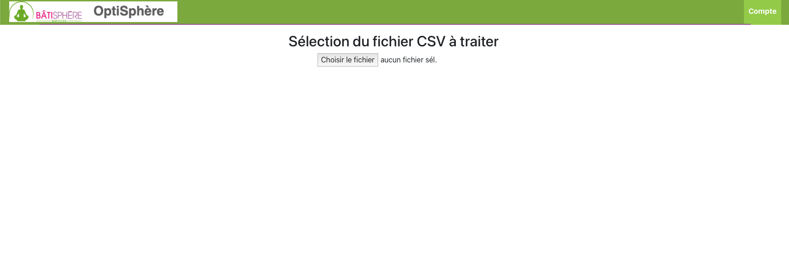
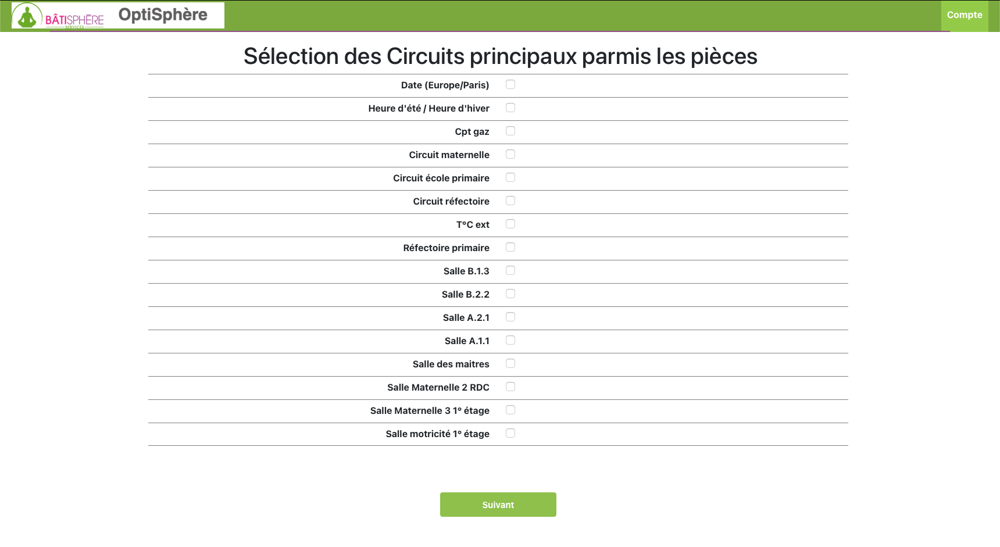
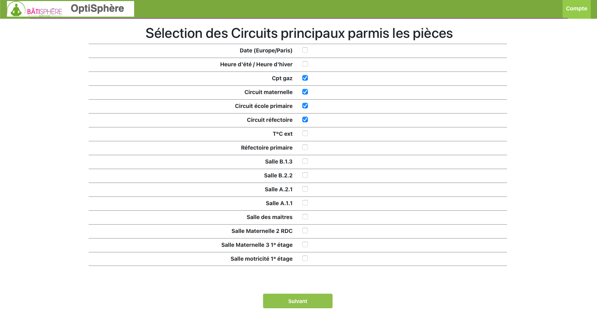
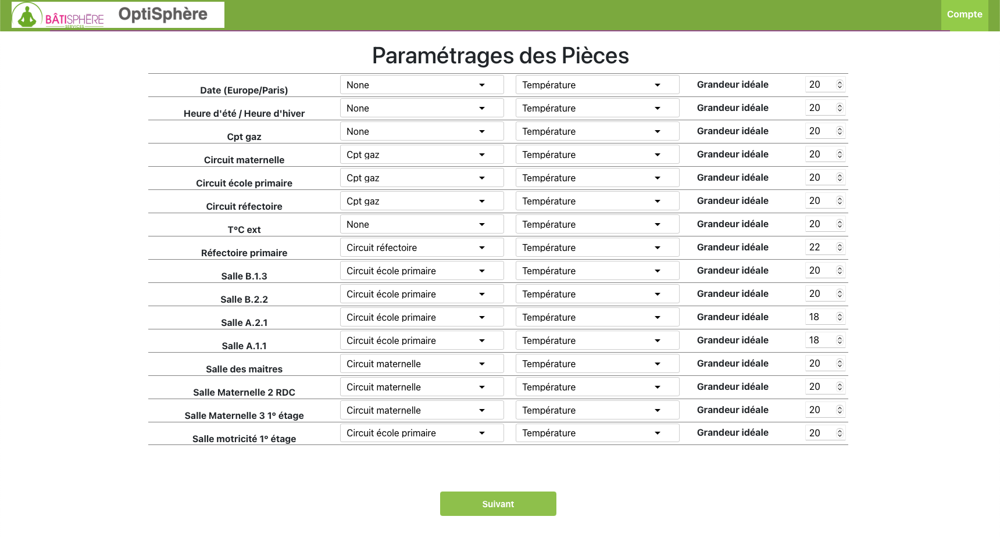
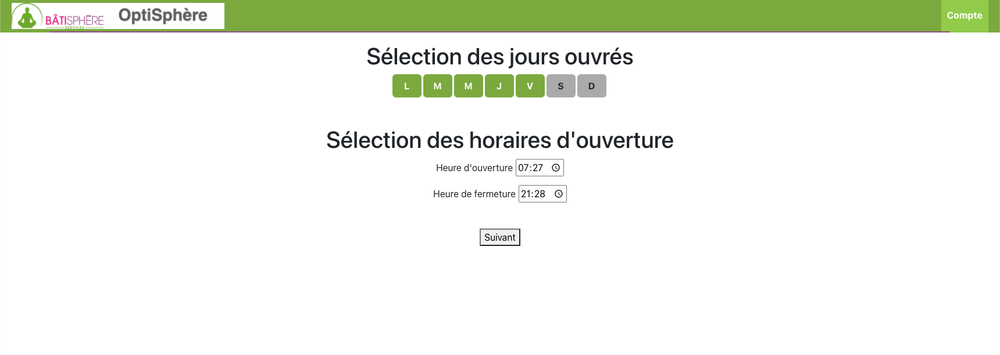
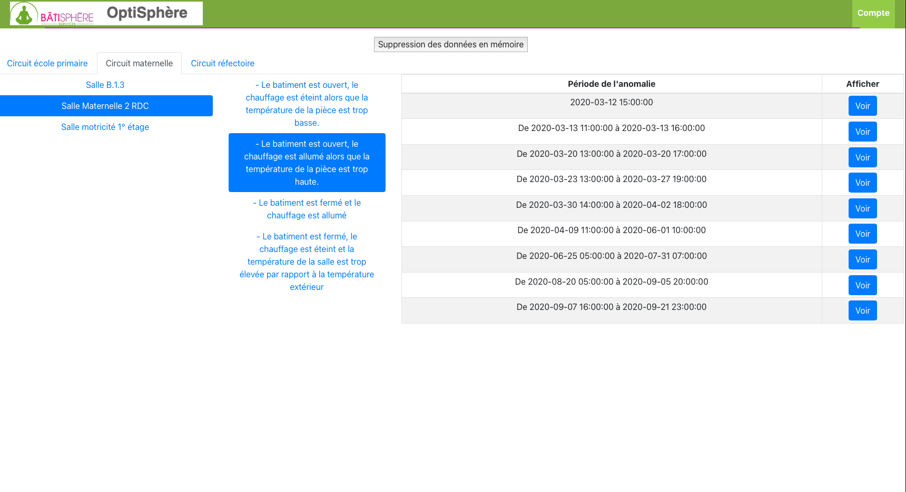
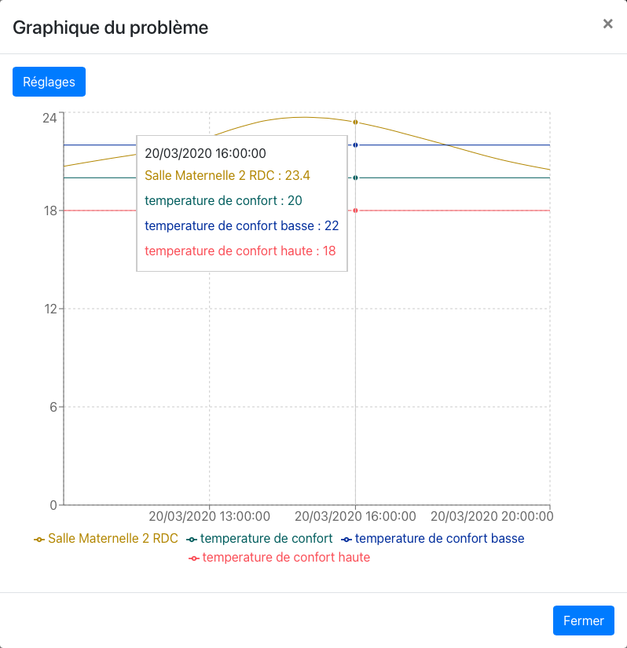

# PFE 2021 - Batisphère Services

## Available Scripts

In the project directory, you can run:

### `yarn start`

Runs the app in the development mode.\
Open [http://localhost:3000](http://localhost:3000) to view it in the browser.

The page will reload if you make edits.\
You will also see any lint errors in the console.

### `yarn start-api`

Runs the backend Flask server. To run this application you have to run this command with the `yarn start`. 

## What can you do on our beautitul B2S app ?

#### Managing accounts
> 1. **Connect with a B2S consultant account and manage customers**
> osdnvù
> sùvdnqsklvoub
> slvnksmv,

> 2. **Connect with an admin account, manage >> customers AND consultants accounts**
> iosnv,msqnùlkqdsf

#### Managing customers data
> 1. **Set data from input file and show abnormalties with charts**
> First of all, if the selected customer does not have a file you are invited to insert a CSV file which contain data.
> 
> Then the list of the columns names in ths CSV file appears. You are invited to select main circuits in the customer's build architecture.
> 
> 
> One you have selected circuits, all the rooms appears with 3 mores columns :
>> The **first one** is the selection of the belonging to a circuit. If this room does not appear in any room or is a not a room (such as "Date", you can let the default "none" value).
>
>> The **second one** is the selection of the physical parameter. By default it is set to temperature and we are only using this one until now.
>
>> The **third one** is the selection of the physical comfort value. For example for a temperature it will be 20 Celsius degree for a customer for a specific room.
>
> 
> Finally, you have to select openings days and the hours where there is people in the building.
>
> 
>
> After this, you have succesfuly set all parameters to calculate abnormalties with the algotihm. The algorithm will be call and the process will run in background for few seconds. You can refresh the window after this time and you will see a window such as below.
> There is all circuits, which contain rooms, each room has a list of abnormalties and each abnormaltie has a list of period where it is catch. 
> 
>
>You can click on a button "Voir" to show a specific chart in a modal.
> 

## Authors

* [@marsovic](https://github.com/marsovic) ~ Marko ARSOVIC :construction: :man_technologist:

* [@L0uwi](https://github.com/L0uwi) ~ Louis CAUQUELIN :chart_with_upwards_trend: :bar_chart:

*  Elias ARRAS :nerd_face:
